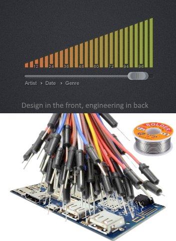

# Dragonboard Web Controls

This is a **bi-directional** way to communicate with a browser and your Dragonboard. This allows you do all your embedded system work in C/C++ and all your UI in JavaScript using the power of a browser. This creates a power way to extend your Dragonboard's functionality. Great way to get into embedded system from web development!

## How to install on Dragonboard 410c running Debian

1. `git clone https://github.com/sjfricke/Dragonboard-Web-Controls.git`
2. `cd Dragonboard-Web-Controls`
3. `make`
4. use extra time to text your parents back

## How to use

### Start the server

After compiling the code just run `./DragonWeb` and your server will start on the Dragonboard

### Access via browser of choice

If you are running the browser **on** the Dragonboard (you have the screen plugged into the HDMI port on the board) then just go to http://localhost:8000

If you are **NOT** running the browser on the Dragonboard (such as your laptop or phone) then you will need to have the Dragonboard be on the same internet network as you.
Once you are both on the same internet a simple `nmcli` will display the IP of your board.
If you didn't change any settings then the default port is 8000.

For **this example** it would be http://192.168.43.41:8000

When you connect on browser you will see it display on console screen.

## How to hack with this

The whole idea behind this is there are only 2 folder `./hardware` and `./website`

- [main.c](./main.c) is your entry file where the whole thing starts
- [./hardware](./hardware) is the folder where all the embedded system work can be done
- [./website](./webiste) is where you write your normal, ES6 website or copy something you already have to it!

## Testing website without Dragonboard

You may run into wanting to run your website, but without DragonWeb running you have no socket to connect to. I provided a little [NodeJS file](./boardless_testing.js) to simulate the board. All call to the server are just absorbed and can be echoed back as well

1. Make sure you have NodeJS installed
2. `npm install` in this directory
3. `node boardless_testing.js`
4. Go to http://localhost:8000

## Why need to be root user

The goal is that you should be able to run this as a non-root user, but with things like GPIO pin access and other hardware, root made development easier.